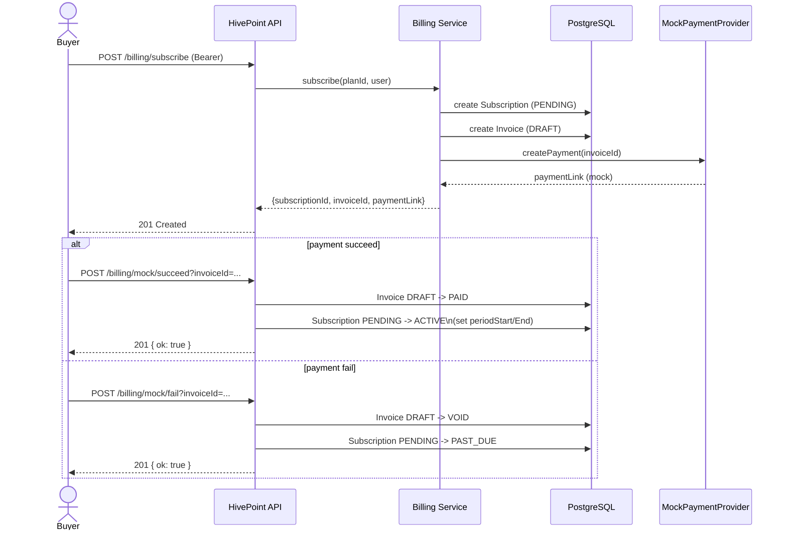
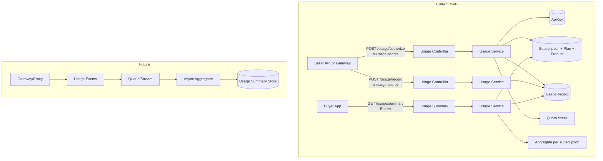
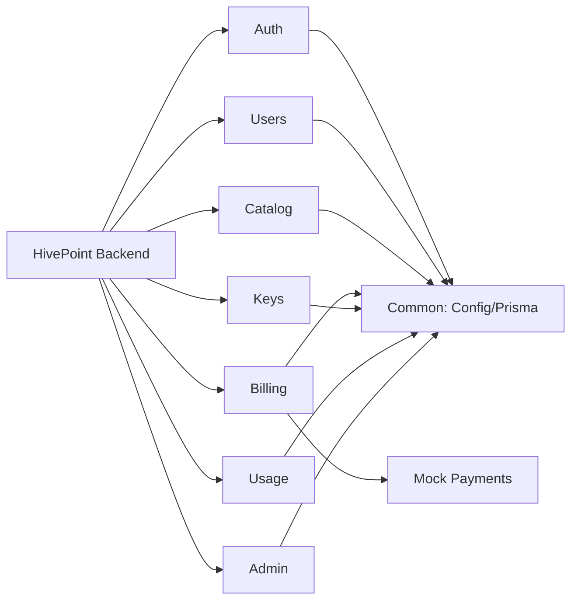

# Diagrams

## Subscribe flow (buyer)

```mermaid
sequenceDiagram
    actor Buyer
    participant API as HivePoint API
    participant Billing as Billing Service
    participant DB as PostgreSQL
    participant Pay as MockPaymentProvider

    Buyer->>API: POST /billing/subscribe (Bearer)
    API->>Billing: subscribe(planId, user)
    Billing->>DB: create Subscription (PENDING)
    Billing->>DB: create Invoice (DRAFT)
    Billing->>Pay: createPayment(invoiceId)
    Pay-->>Billing: paymentLink (mock)
    Billing-->>API: {subscriptionId, invoiceId, paymentLink}
    API-->>Buyer: 201 Created

    alt payment succeed
        Buyer->>API: POST /billing/mock/succeed?invoiceId=...
        API->>DB: Invoice DRAFT -> PAID
        API->>DB: Subscription PENDING -> ACTIVE\n(set periodStart/End)
        API-->>Buyer: 201 { ok: true }
    else payment fail
        Buyer->>API: POST /billing/mock/fail?invoiceId=...
        API->>DB: Invoice DRAFT -> VOID
        API->>DB: Subscription PENDING -> PAST_DUE
        API-->>Buyer: 201 { ok: true }
    end
```

## Access and usage flow

```mermaid
flowchart TB
    subgraph Current MVP
        A[Seller API or Gateway] -->|POST /usage/authorize\nx-usage-secret| B[Usage Controller]
        B --> C[Usage Service]
        C --> D[(ApiKey)]
        C --> E[(Subscription + Plan + Product)]
        C --> F[(UsageRecord)]
        C --> G[Quota check]
        A -->|POST /usage/record\nx-usage-secret| B2[Usage Controller]
        B2 --> C2[Usage Service]
        C2 --> F
        H[Buyer App] -->|GET /usage/summary\nBearer| I[Usage Summary]
        I --> J[Usage Service]
        J --> F
        J --> E
        J --> K[Aggregate per subscription]
    end

    subgraph Future
        L[Gateway/Proxy] --> M[Usage Events]
        M --> N[Queue/Stream]
        N --> O[Async Aggregator]
        O --> P[(Usage Summary Store)]
    end
```

## High-level module map

```mermaid
flowchart LR
    App[HivePoint Backend]

    Auth[Auth]
    Users[Users]
    Catalog[Catalog]
    Billing[Billing]
    MockPay[Mock Payments]
    Keys[Keys]
    Usage[Usage]
    Admin[Admin]
    Common[Common: Config/Prisma]

    App --> Auth
    App --> Users
    App --> Catalog
    App --> Billing
    Billing --> MockPay
    App --> Keys
    App --> Usage
    App --> Admin

    Auth --> Common
    Users --> Common
    Catalog --> Common
    Billing --> Common
    Keys --> Common
    Usage --> Common
    Admin --> Common
```
